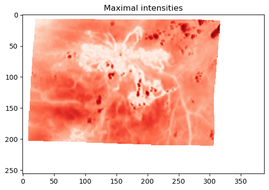
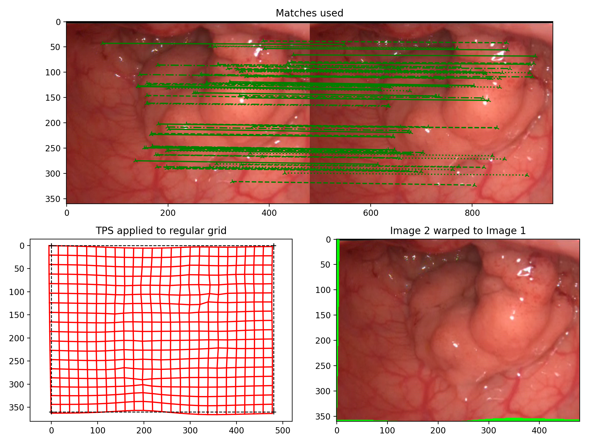

# drl-endeform
Estimate and compensate deformations and/or movements in (endoscopic and other) videos/image sets,  using a keypoint-based approach.

## Installation
Install the requirements. (Note that the requirements file is currently populated manually, so things might be missing)
```bash
pip install -r requirements.txt
```
Clone the repository
```bash
git clone git@github.ibm.com:perfusion/drl-endeform.git
```
Change into the directory you cloned into, and `pip` install (add `-e` to install in editable mode)
```bash
pip install .
```

## Paradigm
Images are processed in pairs. First, each frame goes through the following sequence of operations (operators in {} are optional, the others are mandatory):

    IMAGE -> 
    {image filter(s)} : filtered image -> 
    {keypoint mask computation} : filtered image, bit mask ->
    {2nd set of image filter(s)} : filtered image, bit mask ->
    detector : KeyPoints #locations of interest in the input image# -> 
    descriptor : KeyPoints, their descriptors #vectors, binary or float, describing the neighborhood of each KeyPoint#
    {keypoint filter(s)} : filtered KeyPoints and their descriptors
    ==> End result: KeyPoint locations and their descriptors

 Then the KeyPoints and descriptors of each image are matched, and the difference in location for each matched pair is taken as the movement undergone but this KeyPoint

    (KeyPoints and descriptors of IMAGE1, KeyPoints and descriptors of IMAGE2) ->
    matcher : Pairs of (KeyPoint in IMAGE1, KeyPoint in IMAGE2) -> 
    {match_filter(s)} :  Pairs of (KeyPoint in image1, KeyPoint in image2) -> 
    interpolator : object with eval() method to estimate movement of any given point in IMAGE1

The package contains implementations for all the operations involved, and a `Pipeline` object, which executes the entire chain on pairs of images.
## Quickstart
Here's a very basic example for you, using the `VideoStabilizer` class:
```python
import numpy as np
import matplotlib.pyplot as plt
from endeform import VideoStabilizer as vidstab
# this initializes the VideoStabilizer and the runs the stabilization
vs = vidstab.VideoStabilizer('sample_data/synthetic_example.mp4',
        end=30.0, skip_frames=10,
        FPS=5,
        panel=(0,0,389,256), panel2=(0,256,389,256,1),
        output_layout='9')
 G, G_valid = vs.loop(return_arrays=True, stats=True)
 # G is an array representing the stabilized contents of panel2
 # G_valid[y,x,f]==False, if pixel (x,y) was outside the frame in frame f

# Plot a 2-D heatmap based on the values in panel2 
NIR = np.ma.array(G, mask=np.broadcast_to( ~np.all(G_valid, axis=2)[:,:,np.newaxis], G.shape))
# other option, floats instead of a masked array:
NIR = G.astype(float)
NIR[~np.all(G_valid, axis=2)] = np.nan
# plot
plt.imshow(np.nanmax(NIR, axis=2), cmap='Reds')
plt.title('Maximal intentities')
```
  
There will also be a file `sample_data/synthetic_example_stabilized.mp4`, which is a video visualizing the stabilization, and another one `sample_data/synthetic_example_stabilized_data.npz`, which contains `G, G_valid` and a few more arrays of interest.

A more involved example to demonstrate some of the inner workings of the stabilization process to show what the `VideoStabilizer` loop 
does with every pair `frame[0], frame[t]` of frames:
```python
import cv2  # to read images
import numpy as np
import matplotlib.pyplot as plt
import endeform.helpers.utils as utils  #  we will need the bilinear interpolation from here
# there's a module for each of the operators
import endeform.detectors_descriptors.detect as ddd
import endeform.reflections.glare_detection as glare # for keypoint mask computation
import endeform.matchers.match as match
import endeform.interpolation.TPS as TPS  #  Thin-Plate spline interpolator
import endeform.filters.match_filters as mfilters
import endeform.pipeline as pipeline
# Load two example images
img1 = cv2.imread('./sample_data/Pat43_frame1_deform.PNG')
img2 = cv2.imread('./sample_data/Pat43_frame2_deform.PNG')
h,w,*_ = img1.shape
# Now define the different mandatory operators
akaze = ddd.cv2AKAZE(threshold=.0001)  # detector
latch = ddd.cv2LATCH()  #  descriptor
lowe = match.LoweRatioMatcherBinary() # matcher
tps = TPS.TPS()  #  interpolator
# optional steps
glare_filter = glare.green_glare_mask  #  keypoint mask: mask reflections
bestN = mfilters.best_N(N=75)  #  keep only the best 75 matches
# now we can populate the pipeline. Note that all arguments are keyword arguments.
P = pipeline.Pipeline(
    detector=akaze,
    descriptor=latch,
    matcher=lowe,
    interpolator=tps,
    keypoint_mask=glare.green_glare_mask,
    match_filter=bestN
)
# the pipeline is initialized with the first image, this computes keypoints and descriptors
P.init(img1)
# this computes the second set of keypoints and descriptors, matches them, and interpolates their movement
P.step(img2)
# Now we can estimate the motion of each pixel between img1 and img2
yy, xx = np.meshgrid(np.arange(h), np.arange(w))
Z = P.eval(np.column_stack( (xx.flat, yy.flat ) )).reshape((w,h,2))  
# eval() accepts only 1-D inputs, so the grids xx and yy have to be flattened first, and the result has to be reshaped into an image
# We can now warp img2: Z[py,px,:] is the new position of pixel (py, px). Hence, whatever value we find at 
# pixel Z[py, px, :] in img2 is the value we put at (py, px) in the warped image. We're "putting it back where it came from".
img_warped = utils.bilin_interp(Z[:,:,1].T, Z[:,:,0].T,  #  Z is not of int type, so we have to interpolate from the nearest pixels
            np.arange(h), np.arange(w), img2,  #  img2 provides the values
            extrapolation_value=[0,255,0]  #  if a pixel moved outside of the frame, we fill it with solid green. This will generate a RuntimeWarning, please ignore
            ).astype(np.uint8)
# Now some viusalizations
fig = plt.figure()
# Show the matches that were used to estimate the warp
ax_match = fig.add_subplot(2,2,(1,2))
P.draw_matches(ax=ax_match)  #  convenience method
ax_match.set_title('Matches used')

# Visualize the warp by warping a rectangular grid
ax_warp_grid = fig.add_subplot(2,2,3)
P._interpolator.draw_warped_grid(wh=(w,h), ax=ax_warp_grid)  #  convenience method that every interpolator has
ax_warp_grid.set_title('TPS applied to regular grid')
ax_warp_grid.axis('equal')
ax_warp_grid.invert_yaxis()

ax_warp_img = fig.add_subplot(2,2,4)
ax_warp_img.imshow(img_warped[:,:,::-1])  #  Recall that openCV has BGR color order, plt RGB
ax_warp_img.set_title('Image 2 warped to Image 1')
plt.show()
```

